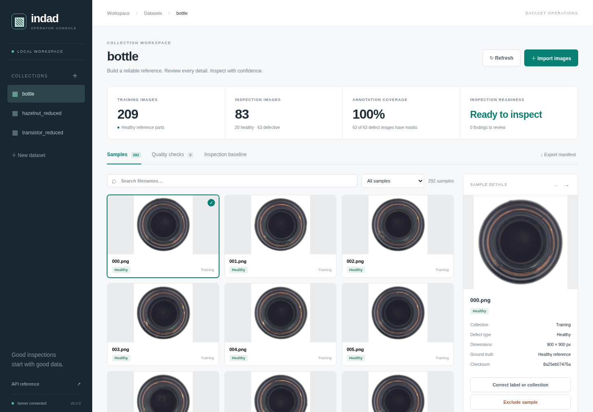
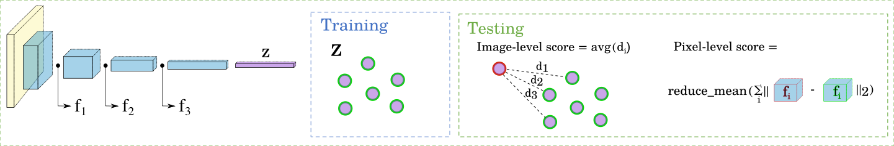
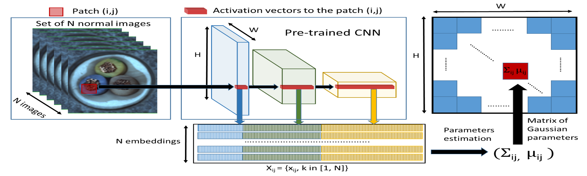
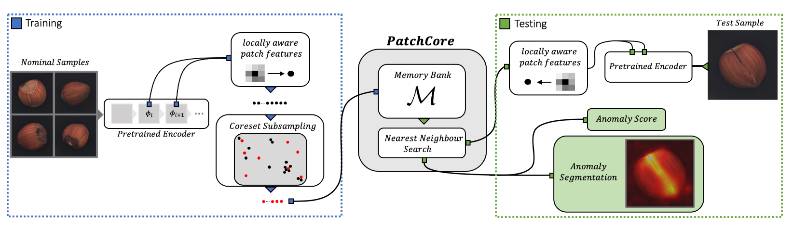

# Industrial anomaly detection · Dataset workspace




Build and inspect industrial anomaly datasets with a workflow designed for
operators and automation: **create → import → check → review → run a baseline**.
The focus is persistent datasets, actionable quality checks, and a small set of
shared model abstractions.

Start the operator workspace:

```shell
python -m pip install -e ".[web]"
indad-web
```

Open `http://127.0.0.1:8000`.

Create datasets, save healthy and defective images, review masks and dataset health,
then train a baseline. Export the same checks and sample inventory as JSON for agents:

```shell
indad-data inspect datasets/your_dataset --require inspection > manifest.json
```

See the [operator and agent dataset workflow](docs/dataset_workflow.md) for creation,
imports, readiness rules, and the Python API.

Three core anomaly detection baselines support this workflow:

1. SPADE (Cohen et al. 2021) - knn in z-space and distance to feature maps
   
2. PaDiM* (Defard et al. 2020) - distance to multivariate Gaussian of feature maps
   
3. PatchCore (Roth et al. 2021) - knn distance to avgpooled feature maps
   

\* actually does not have any knn mechanism, but shares many things implementation-wise.

Current version: **0.4.0**. Releases follow [Semantic Versioning](https://semver.org/);
see the [changelog](CHANGELOG.md) for release notes.

---

## Install

```shell
python -m pip install -e .
```

Install optional UI and export support with
`python -m pip install -e ".[web,export]"`. Python 3.10 or newer is required.

## Usage

CLI:
```shell
indad METHOD [--dataset DATASET]
# or: python run.py METHOD [--dataset DATASET]
```
Results can be found under `./results/`.

Code example:
```python
from indad import MVTecDataset, SPADE

model = SPADE(k=5, backbone_name="resnet18", device="cpu")

# get some training data
class_name = "bottle"
train_ds, test_ds = MVTecDataset(class_name).get_dataloaders()

model.fit(train_ds)  # dataloaders currently use batch_size=1

# evaluate
image_rocauc, pixel_rocauc = model.evaluate(test_ds)
print(image_rocauc, pixel_rocauc)
```

Fitted memory banks are included in the model state, so normal PyTorch persistence
works. Recreate the model with the same constructor options before loading:

```python
import torch

torch.save(model.state_dict(), "spade.pt")
restored = SPADE(k=5, backbone_name="resnet18", pretrained=False)
state = torch.load("spade.pt", map_location="cpu", weights_only=True)
restored.load_state_dict(state)
```

### Custom datasets

Use the dataset workspace or `indad-data create` and `indad-data import` to build a
persistent MVTec-compatible collection. See the [dataset workflow](docs/dataset_workflow.md).
Visual inspection supports datasets without masks; CLI benchmark evaluation requires
pixel-level ground truth.

---

## Results

📝 = paper, 👇 = this repo

### Image-level

| class      | SPADE 📝 | SPADE 👇 | PaDiM 📝   | PaDiM 👇 | PatchCore 📝 | PatchCore 👇 |
|-----------:|:--------:|:--------:|:----------:|:--------:|:------------:|:------------:|
| bottle     | -        | 98.8     |            | 99.8     | ■**100.0**■  | ■**100.0**■  |
| cable      | -        | 76.5     |            | 93.3     | ■**99.5**■   | 96.2         |
| capsule    | -        | 84.6     |            | 88.3     | 98.1         | 95.3         |
| carpet     | -        | 84.3     |            | ■**99.4**| 98.7         | 98.7         |
| grid       | -        | 37.1     |            | 98.2     | ■**98.2**■   | 93.0         |
| hazelnut   | -        | 88.7     |            | 83.7     | ■**100.0**■  | 100.0        |
| leather    | -        | 97.1     |            | 99.9     | ■**100.0**■  | 100.0        |
| metal_nut  | -        | 74.6     |            | 99.4     | ■**100.0**■  | 98.3         |
| pill       | -        | 72.6     |            | 89.0     | ■**96.6**■   | 92.8         |
| screw      | -        | 53.1     |            | 83.0     | 98.1         | 96.7         |
| tile       | -        | 97.8     |            | 98.6     | 98.7         | ■**99.0**■   |
| toothbrush | -        | 89.4     |            | 97.2     | ■**100.0**■  | 98.1         |
| transistor | -        | 89.2     |            | 96.8     | ■**100.0**■  | 99.7         |
| wood       | -        | 98.3     |            | 98.9     | ■**99.2**■   | 98.8         |
| zipper     | -        | 96.7     |            | 89.5     | ■**99.4**■   | 98.4         |
| averages   | 85.5     | 82.6     |  95.3*     | 94.3     | ■**99.1**■   | 97.7         |

* PaDiM average referencing PaDiM-WR50-Rd550

### Pixel-level

| class      | SPADE 📝   | SPADE 👇   | PaDiM 📝 | PaDiM 👇| PatchCore 📝   | PatchCore 👇 |
|-----------:|:----------:|:----------:|:--------:|:-------:|:--------------:|:------------:|
| bottle     | 97.5       | 97.7       | 98.3     | 97.8    | ■**98.6**■     | 97.8         |
| cable      | 93.7       | 94.3       | 96.7     | 96.1    | ■**98.5**■     | 97.4         |
| capsule    | 97.6       | 98.6       | 98.5     | 98.3    | ■**98.9**■     | 98.3         |
| carpet     | 87.4       | 99.0       | 99.1     | 98.6    | ■**99.1**■     | 98.3         |
| grid       | 88.5       | 96.1       | 97.3     | 97.2    | ■**98.7**■     | 96.7         |
| hazelnut   | 98.4       | 98.1       | 98.2     | 97.5    | ■**98.7**■     | 98.1         |
| leather    | 97.2       | 99.2       | 99.2     | 98.7    | ■**99.3**■     | 98.4         |
| metal_nut  | ■**99.0**■ | 96.1       | 97.2     | 96.5    | 98.4           | 96.2         |
| pill       | ■**99.1**■ | 93.5       | 95.7     | 93.2    | 97.6           | 98.7         |
| screw      | 98.1       | 98.9       | 98.5     | 97.8    | ■**99.4**■     | 98.4         |
| tile       | ■**96.5**■ | 93.3       | 94.1     | 94.8    | 95.9           | 94.0         |
| toothbrush | ■**98.9**■ | ■**98.9**■ | 98.8     | 98.3    | 98.7           | 98.1         |
| transistor | ■**97.9**■ | 96.3       | 97.5     | 97.2    | 96.4           | 97.5         |
| wood       | 94.1       | 94.4       | 94.7     | 93.6    | ■**95.1**■     | 91.9         |
| zipper     | 96.5       | 98.2       | 98.5     | 97.4    | ■**98.9**■     | 97.6         |
| averages   | 96.9       | 96.8       | 97.5     | 96.9    | ■**98.1**■     | 97.2         |

__PatchCore-10 was used.__

### Hyperparams

The following parameters were used to calculate the results.
They more or less correspond to the parameters used in the papers.

```yaml
spade:
  backbone: wide_resnet50_2
  k: 50
padim:
  backbone: wide_resnet50_2
  d_reduced: 350
  epsilon: 0.04
patchcore:
  backbone: wide_resnet50_2
  f_coreset: 0.1
  n_reweight: 3
```

---

## Direction

Prioritize dataset creation, review, quality checks and reproducibility for operators
and agents. Keep SPADE, PaDiM and PatchCore as the core models. The next dataset
milestones are capture-group splits, versioned snapshots, and
saved inspection runs with threshold review. See the [workflow and roadmap](docs/dataset_workflow.md).

## Design considerations

- Data is processed in single images to avoid batch-statistics interference. Models
  validate this contract and accept arbitrary spatial input sizes.
- I decided to implement greedy kcenter from scratch and there is room for improvement.
- `torch.nn.AdaptiveAvgPool2d` for feature map resizing, `torch.nn.functional.interpolate` for score map resizing.
- GPU is used for backbones and, when available, coreset selection. Pass
  `device="cpu"` or `--device cpu` for deterministic CPU execution.
- Historical coreset-selection performance:
  - 400-500 it/s @ float32 (RTX3080)
  - 1000+ it/s @ float16 (RTX3080)

---

## Operator console

Install the `web` extra and run `indad-web`. Open `http://127.0.0.1:8000`.
The responsive browser interface includes dataset creation, imports, a searchable
sample gallery, mask review, label correction, reversible sample exclusion,
quality findings, and background baseline inspection.
Use `indad-web --datasets /path/to/datasets --port 8000` to configure local storage.

The console is plain HTML/CSS/JavaScript served by FastAPI, with no frontend build
step. Agents can use the same HTTP API; interactive documentation is at `/docs`
and the OpenAPI schema at `/openapi.json`. See the [HTTP API guide](docs/operator_api.md).

---

## Development

```shell
python -m pip install -e ".[dev,web,export]"
make lint
make test
```

The default tests use a small deterministic backbone and do not download model
weights. ONNX coverage is marked `export`; run it with `pytest -m export` when the
export dependencies are installed.

---

## Acknowledgements

-  [hcw-00](https://github.com/hcw-00) for tipping `sklearn.random_projection.SparseRandomProjection`.
-  [h1day](https://github.com/h1day) for contributing the original heatmap range controls.
- MVTec dataset from https://www.mvtec.com/company/research/datasets/mvtec-ad, please note that this data is CC BY-NC-SA 4.0.

## References

SPADE:
```bibtex
@misc{cohen2021subimage,
      title={Sub-Image Anomaly Detection with Deep Pyramid Correspondences},
      author={Niv Cohen and Yedid Hoshen},
      year={2021},
      eprint={2005.02357},
      archivePrefix={arXiv},
      primaryClass={cs.CV}
}
```

PaDiM:
```bibtex
@misc{defard2020padim,
      title={PaDiM: a Patch Distribution Modeling Framework for Anomaly Detection and Localization},
      author={Thomas Defard and Aleksandr Setkov and Angelique Loesch and Romaric Audigier},
      year={2020},
      eprint={2011.08785},
      archivePrefix={arXiv},
      primaryClass={cs.CV}
}
```

PatchCore:
```bibtex
@misc{roth2021total,
      title={Towards Total Recall in Industrial Anomaly Detection},
      author={Karsten Roth and Latha Pemula and Joaquin Zepeda and Bernhard Schölkopf and Thomas Brox and Peter Gehler},
      year={2021},
      eprint={2106.08265},
      archivePrefix={arXiv},
      primaryClass={cs.CV}
}
```

MVTec dataset:
```bibtex
@article{Bergmann2021,
 author = {Paul Bergmann and Kilian Batzner and Michael Fauser and David Sattlegger and Carsten Steger},
 title = {The MVTec Anomaly Detection Dataset: A Comprehensive Real-World Dataset for Unsupervised Anomaly Detection},
 journal = {International Journal of Computer Vision},
 year = {2021},
 volume = {129},
 number = {4},
 pages = {1038-1059},
 doi = {10.1007/s11263-020-01400-4}
}
```

```bibtex
@inproceedings{Bergmann2019,
 author = {Paul Bergmann and Michael Fauser and David Sattlegger and Carsten Steger},
 title = {MVTec AD — A Comprehensive Real-World Dataset for Unsupervised Anomaly Detection},
 booktitle = {IEEE/CVF Conference on Computer Vision and Pattern Recognition (CVPR)},
 year = {2019},
 pages = {9584-9592},
 doi = {10.1109/CVPR.2019.00982}
}
```
