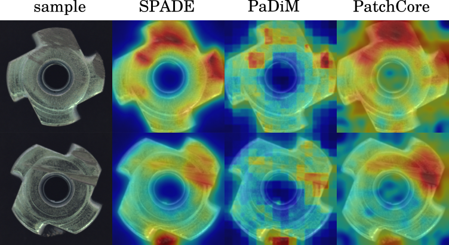
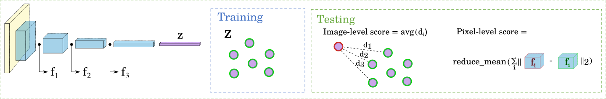
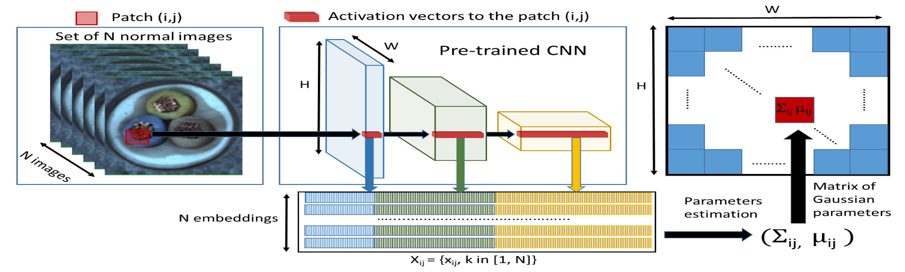
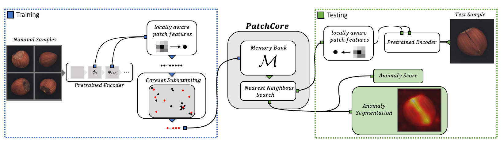

# Industrial KNN-based Anomaly Detection



This repo aims to reproduce the results of the following KNN-based anomaly detection methods:

1. SPADE (Cohen et al. 2021) - knn in z-space and distance to feature maps
   
2. PaDiM* (Defard et al. 2020) - distance to multivariate Gaussian of feature maps
   
3. PatchCore (Roth et al. 2021) - knn distance to avgpooled feature maps
   

* actually does not have any knn mechanism, but shares many things implementation-wise.

---

## Install

```shell
$ pipenv install -r requirements.txt
```
Note: I used torch cu11 wheels.

## Usage

```shell
$ python indad/run.py METHOD [--dataset DATASET]
```
Results can be found under `./results/`.

### Custom datasets
<details>
  <summary> 👁️ </summary>

Check out one of the downloaded MVTec datasets.
Naming of images should correspond among folders.
Right now there is no support for no ground truth pixel masks.

```
📂datasets
 ┗ 📂your_custom_dataset
  ┣ 📂 ground_truth/defective
  ┃ ┣ 📂 defect_type_1
  ┃ ┗ 📂 defect_type_2
  ┣ 📂 test
  ┃ ┣ 📂 defect_type_1
  ┃ ┣ 📂 defect_type_2
  ┃ ┗ 📂 good
  ┗ 📂 train/good
```

```shell
$ python indad/run.py METHOD --dataset your_custom_dataset
```
</details>

---

## Results

📝 = paper, 👇 = this repo

### Image-level

| class      | SPADE 📝 | SPADE 👇 | PaDiM 📝 | PaDiM 👇| PatchCore 📝 | PatchCore 👇 |
|-----------:|:--------:|:--------:|:--------:|:-------:|:------------:|:------------:|
| bottle     | -        | 98.5     | 98.3     | 99.4    | **100.0**    | 99.9         |
| cable      | -        | 92.3     | 96.7     | 91.6    | **99.5**     | 94.5         |
| capsule    | -        | 80.3     | **98.5** | 86.6    | 98.1         | 92.2         |
| carpet     | -        | 59.3     | 99.1     | **99.3**| 98.7         | 95.2         |
| grid       | -        | 31.8     | 97.3     | 96.2    | **98.2**     | 91.2         |
| hazelnut   | -        | 88.5     | 98.2     | 93.4    | **100.0**    | 98.3         |
| leather    | -        | 72.9     | 99.2     | 98.9    | **100.0**    | **100.0**    |
| metal_nut  | -        | 77.6     | 97.2     | 95.6    | **100.0**    | 95.5         |
| pill       | -        | 80.7     | 95.7     | 76.8    | **96.6**     | 88.1         |
| screw      | -        | 63.3     | **98.5** | 71.8    | 98.1         | 81.4         |
| tile       | -        | 91.0     | 94.1     | 95.4    | 98.7         | **99.1**     |
| toothbrush | -        | 83.6     | 98.8     | 100.0   | **100.0**    | 90.6         |
| transistor | -        | 85.6     | 97.5     | 94.6    | **100.0**    | 98.3         |
| wood       | -        | 74.9     | 94.7     | **99.2**| **99.2**     | 98.4         |
| zipper     | -        | 93.6     | 98.5     | 87.1    | **99.4**     | 98.0         |
| averages   | 85.5     | 78.3     | 97.5     | 92.4    | **99.1**     | 93.4         |

### Pixel-level

| class      | SPADE 📝 | SPADE 👇 | PaDiM 📝 | PaDiM 👇| PatchCore 📝 | PatchCore 👇 |
|-----------:|:--------:|:--------:|:--------:|:-------:|:------------:|:------------:|
| bottle     | 97.5     | 96.6     | 94.8     | 96.3    | **98.6**     | 96.1         | 
| cable      | 93.7     | 96.0     | 88.8     | 95.2    | **98.5**     | 97.6         | 
| capsule    | 97.6     | 98.4     | 93.5     | 97.5    | **98.9**     | 96.8         | 
| carpet     | 87.4     | **98.9** | 96.2     | 97.9    | 99.1         | 97.6         | 
| grid       | 88.5     | 96.0     | 94.6     | 90.1    | **98.7**     | 94.4         | 
| hazelnut   | 98.4     | 98.6     | 92.6     | 96.9    | **98.7**     | 98.0         | 
| leather    | 97.2     | 99.2     | 97.8     | 98.5    | **99.3**     | 98.3         | 
| metal_nut  | **99.0** | 96.2     | 85.6     | 95.9    | 98.4         | 96.5         | 
| pill       | **99.1** | 92.6     | 92.7     | 92.2    | 97.6         | 98.0         | 
| screw      | 98.1     | 99.0     | 94.4     | 95.5    | **99.4**     | 96.3         | 
| tile       | **96.5** | 89.2     | 86.0     | 85.9    | 95.9         | 91.0         | 
| toothbrush | **98.9** | 98.8     | 93.1     | 98.4    | 98.7         | 97.9         | 
| transistor | **97.9** | 96.5     | 84.5     | 96.9    | 96.4         | **97.9**     | 
| wood       | 94.1     | 95.0     | 91.1     | 91.6    | **95.1**     | 92.0         | 
| zipper     | 96.5     | 98.0     | 95.9     | 96.4    | **98.9**     | 96.0         | 
| averages   | 96.0     | 96.6     | 92.1     | 95.0    | **98.1**     | 94.7         |

__PatchCore-10 was used.__

### Hyperparams

The following parameters were used to calculate the results. 
They more or less correspond to the parameters used in the papers.

```yaml
spade:
  backbone: wide_resnet50_2
  k: 50
padim:
  backbone: wide_resnet50_2
  d_reduced: 250
  epsilon: 0.04
patchcore:
  backbone: wide_resnet50_2
  f_coreset: 0.25
  n_reweight: 3
```

---

## Progress

- [x] Datasets
- [x] Code skeleton
- [ ] Config files
- [x] CLI
- [x] Logging
- [x] SPADE
- [x] PADIM
- [x] PatchCore
- [x] Add custom dataset option
- [x] Add dataset progress bar
- [x] Add schematics
- [ ] Unit tests

## Design considerations

- Data is processed in single images to avoid batch statistics interference.
- I decided to implement greedy kcenter from scratch and there is room for improvement.
- `torch.nn.AdaptiveAvgPool2d` for feature map resizing, `torch.nn.functional.interpolate` for score map resizing.
- GPU is used for backbones and coreset selection (20x speedup).

---

## Acknowledgements

-  [hcw-00](https://github.com/hcw-00) for tipping `sklearn.random_projection.SparseRandomProjection`

## References

SPADE:
```bibtex
@misc{cohen2021subimage,
      title={Sub-Image Anomaly Detection with Deep Pyramid Correspondences}, 
      author={Niv Cohen and Yedid Hoshen},
      year={2021},
      eprint={2005.02357},
      archivePrefix={arXiv},
      primaryClass={cs.CV}
}
```

PaDiM:
```bibtex
@misc{defard2020padim,
      title={PaDiM: a Patch Distribution Modeling Framework for Anomaly Detection and Localization}, 
      author={Thomas Defard and Aleksandr Setkov and Angelique Loesch and Romaric Audigier},
      year={2020},
      eprint={2011.08785},
      archivePrefix={arXiv},
      primaryClass={cs.CV}
}
```

PatchCore:
```bibtex
@misc{roth2021total,
      title={Towards Total Recall in Industrial Anomaly Detection}, 
      author={Karsten Roth and Latha Pemula and Joaquin Zepeda and Bernhard Schölkopf and Thomas Brox and Peter Gehler},
      year={2021},
      eprint={2106.08265},
      archivePrefix={arXiv},
      primaryClass={cs.CV}
}
```
